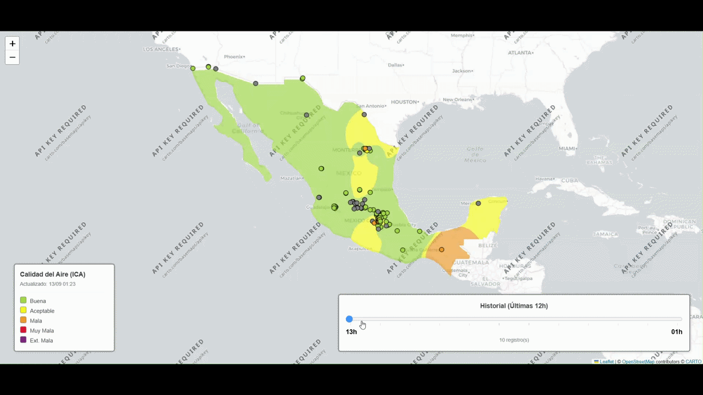
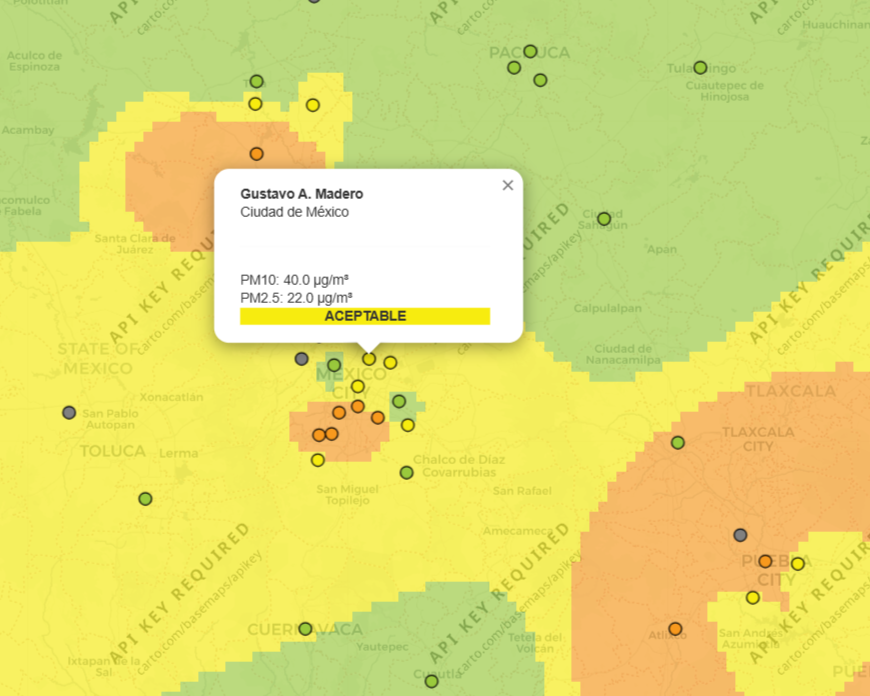

# geo-atmospheric-monitoring
Una aplicación de datos desarrollada en Phyton que colecta mediciones públicas de calidad del aire en México, procesa datos de contaminación, estima la concentración espacial mediante interpolación de distancia inversa (IDW) y muestra los resultados en un mapa web interactivo. El proyecto se construyó como un flujo de trabajo de datos end-to-end, iniciando con la recopilación y limpieza de datos hasta el análisis espacial y visualización.




## Resumen General
La aplicación utiliza datos de monitoreo de contaminantes disponibles en la red pública SINAICA.

Para cada estación de monitoreo disponible en la red, la aplicación realiza el siguiente flujo de trabajo:

1. Recupera las mediciones más recientes de los contaminantes $PM_{10}$ y $PM_{2.5}$.

2. Limpia los valores faltantes y no numéricos.

3. Asigna categorías de calidad del aire (buena, aceptable, mala, muy mala, extremadamente mala) a las mediciones de las estaciones.

4. Interpola mediante IDW las mediciones continuas de $PM_{10}$ y $PM_{2.5}$ dentro de una cuadrícula geográfica.

5. Aplica una máscara geográfica para limitar la superficie al territorio de México.

6. Convierte las concentraciones interpoladas en categorías de calidad del aire.

7. Genera un mapa interactivo con información a nivel puntual (de estación) y capas históricas por hora.

La aplicación mantiene las últimas 12 observaciones, permitiendo al usuario navegar a través de las mediciones utilizando un time slider.

## Data Workflow

Datos de monitoreo públicos

↓

Extracción de datos

↓

Limpieza y validación

↓

Clasificación de $PM_{10}$ y $PM_{2.5}$ 

↓

Interpolación espacial (IDW)

↓

Masking geográfico

↓

Rasterización

↓

Mapa interactivo

## Enfoques Ténicos

La aplicación desarrollada utiliza interpolación IDW para estimar concentraciones de contaminantes entre estaciones de monitoreo.

Para cada punto dentro de la cuadrícula geográfica, el valor estimado se calcula a partir de las mediciones disponibles de las estaciones utilizando ponderaciones basadas en la distancia. Se utiliza una resolución de cuadrícula de 0.02°, pero puede ser ajustada en el código fuente. La interpolación se realiza sobre las mediciones continuas de $PM_{10}$ y $PM_{2.5}$ (una interpolación para cada una) antes de convertir la superficie resultante en categorías de calidad del aire, las cuales se asignan usando el mayor nivel categórico de ambos contaminante, es decir, se toma el que presente peor categoría. 

La cuadrícula de interpolación cubre inicialmente un espacio más amplio alrededor de México. Se utiliza un polígono GeoJSON para conservar únicamente las celdas de la cuadrícula ubicadas dentro del territorio del país. La máscara resultante se almacena en caché y se reutiliza durante las actualizaciones posteriores.

La aplicación utiliza `Folium` para generar el mapa interactivo y muestra la superficie interpolada como una imagen raster. En lugar de crear un gran número de elementos de mapa individuales para la cuadrícula interpolada, el raster se genera como una imagen PNG y se incrusta directamente en la aplicación.


## Estructura del Repositorio

geo-atmospheric-monitoring/

│

├── assets/                    

│   └── national_demo.gif  # Animación de la interfaz

│   └── zoom_national_demo.png  # Imagen de la interfaz a nivel estación


│


├── src/ 

│   └── nacional.py         # Script de la app

│

├── .gitignore                 
├── LICENSE                    
├── requirements.txt           
└── README.md

## Instalación


1. Clonar el repositorio

```git clone https://github.com/emmanuelgh3/geo-atmospheric-monitoring.git```

```cd geo-atmospheric-monitoring```

2. Instalar dependencias

```pip install -r requirements.txt```

3. Ejecutar el servidor

```python src/app_nacional.py```

La aplicación iniciará un servidor local en [http://127.0.0.1:5003](http://127.0.0.1:5003).

## Notas

* La aplicación depende de datos disponibles públicamente de SINAICA y de fuentes externas de GeoJSON para la delimitación. Debido a que estos son recursos externos, los cambios en su estructura o disponibilidad pueden requerir actualizaciones en el código.


